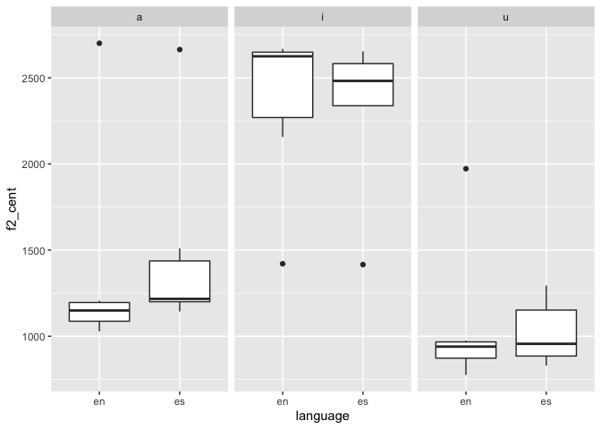

pa\_3
================

``` r
library(tidyverse)
```

    ## ── Attaching packages ─────────────── tidyverse 1.2.1 ──

    ## ✔ ggplot2 3.3.0       ✔ purrr   0.3.3  
    ## ✔ tibble  2.1.1       ✔ dplyr   0.8.0.1
    ## ✔ tidyr   0.8.3       ✔ stringr 1.4.0  
    ## ✔ readr   1.3.1       ✔ forcats 0.4.0

    ## ── Conflicts ────────────────── tidyverse_conflicts() ──
    ## ✖ dplyr::filter() masks stats::filter()
    ## ✖ dplyr::lag()    masks stats::lag()

``` r
read_csv("data/vowel_data.csv")
```

    ## Parsed with column specification:
    ## cols(
    ##   id = col_character(),
    ##   item = col_character(),
    ##   vowel = col_character(),
    ##   language = col_character(),
    ##   f1_cent = col_double(),
    ##   f2_cent = col_double(),
    ##   tl = col_double(),
    ##   f1_20 = col_double(),
    ##   f1_35 = col_double(),
    ##   f1_50 = col_double(),
    ##   f1_65 = col_double(),
    ##   f1_80 = col_double(),
    ##   f2_20 = col_double(),
    ##   f2_35 = col_double(),
    ##   f2_50 = col_double(),
    ##   f2_65 = col_double(),
    ##   f2_80 = col_double()
    ## )

    ## # A tibble: 36 x 17
    ##    id    item  vowel language f1_cent f2_cent    tl f1_20 f1_35 f1_50 f1_65
    ##    <chr> <chr> <chr> <chr>      <dbl>   <dbl> <dbl> <dbl> <dbl> <dbl> <dbl>
    ##  1 edl   meet  i     en          357.   2157. 1797.  342.  318.  323.  434 
    ##  2 edl   beat  i     en          272.   2668.  256.  254.  295.  282.  252.
    ##  3 edl   feet  i     en          278.   2609.  261.  302.  323.  289.  276.
    ##  4 edl   seat  i     en          305.   2641.  509.  280.  303.  336.  351.
    ##  5 edl   heat  i     en          298.   2651.  340.  285.  284.  297.  314.
    ##  6 edl   fleet a     en          314.   2701.  341.  291.  301.  311.  370.
    ##  7 edl   moss  a     en          689.   1164.  142.  724.  728.  690.  653.
    ##  8 edl   bot   a     en          744.   1136.  189.  750.  756.  758.  730.
    ##  9 edl   foug… a     en          659.   1028.  396.  620.  651.  672.  679.
    ## 10 edl   soug… a     en          726.   1207.  611.  725.  715.  724.  744.
    ## # … with 26 more rows, and 6 more variables: f1_80 <dbl>, f2_20 <dbl>,
    ## #   f2_35 <dbl>, f2_50 <dbl>, f2_65 <dbl>, f2_80 <dbl>

``` r
my_data <- read_csv("data/vowel_data.csv")
```

    ## Parsed with column specification:
    ## cols(
    ##   id = col_character(),
    ##   item = col_character(),
    ##   vowel = col_character(),
    ##   language = col_character(),
    ##   f1_cent = col_double(),
    ##   f2_cent = col_double(),
    ##   tl = col_double(),
    ##   f1_20 = col_double(),
    ##   f1_35 = col_double(),
    ##   f1_50 = col_double(),
    ##   f1_65 = col_double(),
    ##   f1_80 = col_double(),
    ##   f2_20 = col_double(),
    ##   f2_35 = col_double(),
    ##   f2_50 = col_double(),
    ##   f2_65 = col_double(),
    ##   f2_80 = col_double()
    ## )

get means and SDs
=================

``` r
# get mean for f1_cent
mean_f1_cent <- mean(my_data$f1_cent)
# get sd for f1_cent
sd_f1_cent <- sd(my_data$f1_cent)
# get mean for f2_cent
mean_f2_cent <- mean(my_data$f2_cent)
# get sd for f2_cent
sd_f2_cent <- sd(my_data$f2_cent)
```

get trajectory legth
====================

``` r
# get traj legth for f1
mutate(my_data, traj_length_f1 = (f1_20) + (f1_35) + (f1_50) + (f1_65) + (f1_80))
```

    ## # A tibble: 36 x 18
    ##    id    item  vowel language f1_cent f2_cent    tl f1_20 f1_35 f1_50 f1_65
    ##    <chr> <chr> <chr> <chr>      <dbl>   <dbl> <dbl> <dbl> <dbl> <dbl> <dbl>
    ##  1 edl   meet  i     en          357.   2157. 1797.  342.  318.  323.  434 
    ##  2 edl   beat  i     en          272.   2668.  256.  254.  295.  282.  252.
    ##  3 edl   feet  i     en          278.   2609.  261.  302.  323.  289.  276.
    ##  4 edl   seat  i     en          305.   2641.  509.  280.  303.  336.  351.
    ##  5 edl   heat  i     en          298.   2651.  340.  285.  284.  297.  314.
    ##  6 edl   fleet a     en          314.   2701.  341.  291.  301.  311.  370.
    ##  7 edl   moss  a     en          689.   1164.  142.  724.  728.  690.  653.
    ##  8 edl   bot   a     en          744.   1136.  189.  750.  756.  758.  730.
    ##  9 edl   foug… a     en          659.   1028.  396.  620.  651.  672.  679.
    ## 10 edl   soug… a     en          726.   1207.  611.  725.  715.  724.  744.
    ## # … with 26 more rows, and 7 more variables: f1_80 <dbl>, f2_20 <dbl>,
    ## #   f2_35 <dbl>, f2_50 <dbl>, f2_65 <dbl>, f2_80 <dbl>,
    ## #   traj_length_f1 <dbl>

``` r
# make it an object
traj_length_f1 <- mutate(my_data, traj_length_f1 = (f1_20) + (f1_35) + (f1_50) + (f1_65) + (f1_80))

# get traj legth for f2
mutate(my_data, traj_length_f2 = (f2_20) + (f2_35) + (f2_50) + (f2_65) + (f2_80))
```

    ## # A tibble: 36 x 18
    ##    id    item  vowel language f1_cent f2_cent    tl f1_20 f1_35 f1_50 f1_65
    ##    <chr> <chr> <chr> <chr>      <dbl>   <dbl> <dbl> <dbl> <dbl> <dbl> <dbl>
    ##  1 edl   meet  i     en          357.   2157. 1797.  342.  318.  323.  434 
    ##  2 edl   beat  i     en          272.   2668.  256.  254.  295.  282.  252.
    ##  3 edl   feet  i     en          278.   2609.  261.  302.  323.  289.  276.
    ##  4 edl   seat  i     en          305.   2641.  509.  280.  303.  336.  351.
    ##  5 edl   heat  i     en          298.   2651.  340.  285.  284.  297.  314.
    ##  6 edl   fleet a     en          314.   2701.  341.  291.  301.  311.  370.
    ##  7 edl   moss  a     en          689.   1164.  142.  724.  728.  690.  653.
    ##  8 edl   bot   a     en          744.   1136.  189.  750.  756.  758.  730.
    ##  9 edl   foug… a     en          659.   1028.  396.  620.  651.  672.  679.
    ## 10 edl   soug… a     en          726.   1207.  611.  725.  715.  724.  744.
    ## # … with 26 more rows, and 7 more variables: f1_80 <dbl>, f2_20 <dbl>,
    ## #   f2_35 <dbl>, f2_50 <dbl>, f2_65 <dbl>, f2_80 <dbl>,
    ## #   traj_length_f2 <dbl>

``` r
# make it an object
traj_length_f2 <- mutate(my_data, traj_length_f2 = (f2_20) + (f2_35) + (f2_50) + (f2_65) + (f2_80))
```

plot for trajectory length of F1 as a function of vowel and language
====================================================================

``` r
traj_length_f1 %>%  
  ggplot(., aes(x = language, y = traj_length_f1)) +
    geom_boxplot() +
    facet_grid(. ~ vowel)
```


plot for f1 as a function of vowel and language
===============================================

``` r
my_data %>%  
  ggplot(., aes(x = language, y = f1_cent)) +
    geom_boxplot() +
    facet_grid(. ~ vowel)
```


plot for trajectory legth of F2 as a function of vowel and language
===================================================================

``` r
traj_length_f2 %>%  
  ggplot(., aes(x = language, y = traj_length_f2)) +
    geom_boxplot() +
    facet_grid(. ~ vowel)
```


plot for f2 as a function of vowel and language
===============================================

``` r
my_data %>%  
  ggplot(., aes(x = language, y = f2_cent)) +
    geom_boxplot() +
    facet_grid(. ~ vowel)
```



Question 7
==========

### a. This part of the script calculates the time landmarks of the vowels. It first gets the values of the onset and the offset of the vowels. Then it calculates their duration, by substracting the offset from the onset. The last procedure calculates the five time landmarks by multiplying vowel duration by the five different percentages and then adding the product to vowel onset.

### b. The script has three parts. What the first one does is (a) set in which folder the script will store the file that will be generated, (b) name the file, (c) create headers for the different data categories (e.g., id, item, f1\_80, etc.). The second part (a) selects the folder from which the .wav and .textgrid files are going to be retrieved, (b) adds a string variable for a personal id. The third part is the most important one. It retrieves the information from the intervals and point tiers (item, vowel, and language) and extracts important information about the vowel (its onset and offset, its duration, and the five time landmarks for both the f1 and the f2). In addition, it calculates spectral centroids (i.e., the sum of all five time landmarks for both formants divided by five). Finally, it prints the results and saves them to the .csv file.

### c. This analysis contains more information than the previous one. More specifically, it gets the time landmarks for f1 and f2 and tl besides vowel duration, which is a great advantage for the pa3 segmentation. I don't see a clear disadvantage for the current script/analysis, although it could be argued that getting the zero crossing for vowel onset and offset for each vowel for each item can be tedious.
